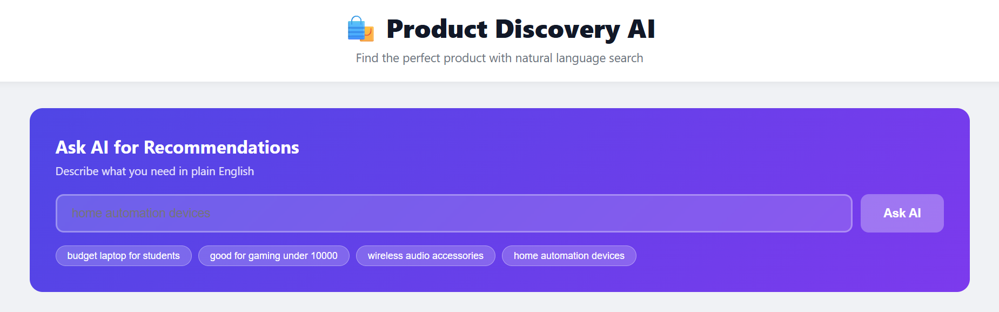
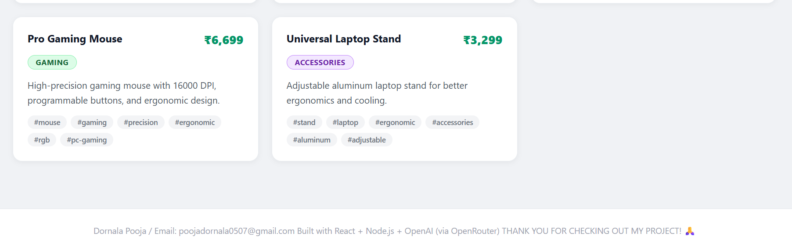
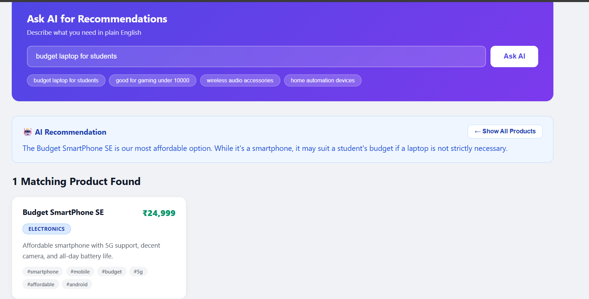

# 🛍️ Product Discovery AI

> A full-stack AI-powered product discovery system where users search in plain English and get intelligent product recommendations instantly — built with Node.js, Express, React, and OpenRouter (free LLM API).







[](https://nodejs.org)
[](https://reactjs.org)
[](https://expressjs.com)
[](LICENSE)

---

## 📌 Project Overview

Product Discovery AI is a mini e-commerce search engine powered by a Large Language Model. Instead of typing exact product names, users describe what they need in natural language — like *"something good for gaming under ₹10,000"* — and the AI returns the most relevant products with a helpful explanation.

This project was built as a full-stack assessment demonstrating:
- LLM API integration with structured prompt engineering
- RESTful backend with Express
- React frontend with hooks-based state management
- Production-quality error handling and modular code structure

---

## ✨ Features

- 🤖 **AI Natural Language Search** — Describe what you need, AI finds it
- 🗂️ **Product Catalog** — 8 products across Electronics, Gaming, and Accessories
- 🔍 **Category Filtering** — Browse All / Electronics / Gaming / Accessories
- 💬 **AI Summary** — Explains why each product matches your query
- ⚡ **Fast UI** — Pure React with Fetch API, no heavy libraries
- 🛡️ **Graceful Error Handling** — Never crashes, always shows useful messages
- 📱 **Responsive Design** — Works on desktop and mobile
- 🔒 **Secure** — API keys stored in `.env`, never exposed to frontend

---

## 🧱 Tech Stack

| Layer | Technology | Why |
|-------|-----------|-----|
| **Frontend** | React 18 (functional components) | Component-based, fast, industry standard |
| **State Management** | `useState` + `useEffect` | Built-in React hooks, no extra libraries |
| **HTTP Client** | Fetch API | Native browser API, no dependencies needed |
| **Backend** | Node.js + Express | Lightweight, fast REST API server |
| **LLM Integration** | OpenRouter API (free tier) | Free access to top models, OpenAI-compatible |
| **AI Model** | `openrouter/auto` | Auto-selects best available free model |
| **Config** | `dotenv` | Secure environment variable management |
| **Dev Server** | `nodemon` | Auto-restarts on file changes |

---

## 📁 Project Structure

```
product-discovery-ai/
│
├── backend/
│   ├── server.js              # Express server, API routes, error handling
│   ├── llmService.js          # LLM integration, prompt design, response parsing
│   ├── data/
│   │   └── products.json      # Product catalog (8 products, in-memory)
│   ├── .env                   # Your secret API keys (never commit this!)
│   ├── .env.example           # Template showing required env variables
│   └── package.json           # Backend dependencies
│
├── frontend/
│   ├── src/
│   │   ├── App.js             # Root component, layout, state orchestration
│   │   ├── api.js             # All API call functions (fetch wrapper)
│   │   └── components/
│   │       ├── AskBox.js      # AI search input + button + results display
│   │       ├── ProductList.js # Grid container for product cards
│   │       └── ProductCard.js # Single reusable product card component
│   └── package.json           # Frontend dependencies
│
├── screenshot.png             # App screenshot (shown above)
└── README.md                  # This file
```

---

## 🚀 Local Setup & Installation

### Prerequisites
- **Node.js v18+** — [Download here](https://nodejs.org)
- **A free OpenRouter API key** — [Get it here](https://openrouter.ai/keys) (sign in with Google)

---

### Step 1 — Clone the Repository

```bash
git clone https://github.com/Poojadornala/Product-Discovery-AI.git
cd Product-Discovery-AI
```

---

### Step 2 — Backend Setup

```bash
cd backend
npm install
```

Create your environment file:

```bash
# Windows:
copy .env.example .env

# Mac/Linux:
cp .env.example .env
```

Open `backend/.env` and add your key:

```env
OPENROUTER_API_KEY=sk-or-v1-your-actual-key-here
PORT=5000
NODE_ENV=development
FRONTEND_URL=http://localhost:3000
```

> ⚠️ Never share or commit your `.env` file. It's already listed in `.gitignore`.

Start the backend dev server:

```bash
npm run dev
```

✅ You should see:
```
🚀 Server running on http://localhost:5000
🤖 AI API: Configured ✓
```

---

### Step 3 — Frontend Setup

Open a **new terminal window**:

```bash
cd frontend
npm install
npm start
```

✅ App opens automatically at **http://localhost:3000**

---

### Step 4 — Test It

Try these searches in the AI search box:
- `"budget laptop for students"`
- `"good for gaming under ₹10000"`
- `"wireless audio accessories"`
- `"smart home devices"`

---

## 📡 API Documentation

### `GET /api/products`

Returns all products from the catalog.

**Optional query parameter:**
```
GET /api/products?category=Gaming
```

**Success Response `200`:**
```json
{
  "success": true,
  "count": 3,
  "products": [
    {
      "id": 2,
      "name": "GameStation X Pro",
      "category": "Gaming",
      "price": 41999,
      "description": "Next-gen gaming console with 4K support...",
      "tags": ["gaming", "console", "4k", "multiplayer"]
    }
  ]
}
```

---

### `POST /api/ask`

Sends a natural language query to the AI and returns matched products.

**Request Body:**
```json
{
  "query": "budget laptop for students"
}
```

**Success Response `200`:**
```json
{
  "success": true,
  "query": "budget laptop for students",
  "summary": "Here are 2 affordable laptops perfect for students with great performance.",
  "products": [...],
  "matchCount": 2
}
```

**Error Response `400` — Empty query:**
```json
{
  "success": false,
  "error": "Query is required"
}
```

**Error Response `502` — AI unavailable:**
```json
{
  "success": false,
  "error": "AI service unavailable"
}
```

---

## 🤖 Prompt Design Explanation

The LLM prompt is the core of the AI search. Here is how it is engineered:

```
You are a product recommendation assistant.
Analyze the user query and match it with relevant products.

Product Catalog:
[
  { "id": 1, "name": "UltraBook Pro 15", "category": "Electronics",
    "price": 74999, "tags": ["laptop", "professional", "portable"] },
  ...all 8 products...
]

User Query: "budget laptop for students"

Respond ONLY with valid JSON, no extra text, no markdown backticks:
{
    "productIds": [array of matching product IDs as numbers],
    "summary": "A helpful 1-2 sentence explanation"
}
```

**Key design decisions:**

| Decision | Reason |
|----------|--------|
| Embed full product catalog in prompt | Gives AI full context to match accurately |
| Include id, name, category, price, tags | Tags are critical for semantic matching |
| Force JSON-only output | Prevents extra text breaking `JSON.parse()` |
| Regex fallback parser | Recovers if AI wraps response in markdown |
| `openrouter/auto` model | Picks best available free model automatically |

---

## 🛡️ Error Handling

Every failure case is handled gracefully:

| Scenario | HTTP Code | Behavior |
|----------|-----------|----------|
| Missing API key in `.env` | 502 | Returns clear setup message |
| Empty or missing query | 400 | Returns validation error |
| AI returns malformed JSON | — | Regex fallback attempts recovery |
| AI service down or rate limited | 502 | Returns `"AI service unavailable"` |
| Invalid endpoint | 404 | Returns `"Endpoint not found"` |
| Frontend fetch fails | — | Shows error banner, never crashes |

All LLM calls are wrapped in `try/catch`. The frontend uses `useState` for error display and always shows the full product catalog even if the AI search fails.

---

## 🌍 Deployment Guide

### Frontend → Vercel (Free)

1. Go to [vercel.com](https://vercel.com) and sign in with GitHub
2. Click **"Add New Project"** → Import your `Product-Discovery-AI` repo
3. Set **Root Directory** to `frontend`
4. Under **Environment Variables**, add:
   ```
   REACT_APP_API_URL = https://your-backend.onrender.com
   ```
5. Click **Deploy** → Live in ~2 minutes

Your app URL: `https://product-discovery-ai.vercel.app`

---

### Backend → Render (Free)

1. Go to [render.com](https://render.com) → **New Web Service**
2. Connect your GitHub repo
3. Configure the service:
   - **Root Directory:** `backend`
   - **Build Command:** `npm install`
   - **Start Command:** `npm start`
4. Under **Environment Variables**, add:
   ```
   OPENROUTER_API_KEY = sk-or-v1-your-key-here
   PORT = 5000
   FRONTEND_URL = https://your-app.vercel.app
   ```
5. Click **Deploy** → Live in ~3 minutes

> 💡 After both are deployed, update `FRONTEND_URL` on Render with your real Vercel URL, and update `REACT_APP_API_URL` on Vercel with your real Render URL. Then redeploy both.

---

### Alternative Backend → Railway

1. Go to [railway.app](https://railway.app) → **New Project**
2. Deploy from GitHub → select your repo
3. Set root to `backend` and add the same environment variables as above
4. Railway auto-detects Node.js and deploys automatically

---

## ⚙️ Environment Variables Reference

**`backend/.env`**
```env
# Required — get free key at openrouter.ai/keys
OPENROUTER_API_KEY=sk-or-v1-xxxxxxxxxxxxxxxx

# Optional — defaults shown below
PORT=5000
NODE_ENV=development
FRONTEND_URL=http://localhost:3000
```

**`frontend/.env`** — only needed for production deployment
```env
REACT_APP_API_URL=https://your-backend.onrender.com
```

---

## 🧩 Component Architecture

```
App.js  ──  manages all global state
├── AskBox.js          →  query input, calls /api/ask, shows AI summary
├── ProductList.js     →  renders grid of cards
│   └── ProductCard.js →  single product: name, price, category, tags
└── api.js             →  fetchProducts() and askAI() — API layer
```

**State in `App.js`:**
```javascript
const [products, setProducts] = useState([]);    // full catalog
const [results,  setResults]  = useState(null);  // AI search results
const [loading,  setLoading]  = useState(false); // loading state
const [error,    setError]    = useState(null);  // error message
const [category, setCategory] = useState('All'); // active filter tab
```

---

## ⏱️ Time Taken

| Phase | Time |
|-------|------|
| Backend setup + API routes | ~1 hour |
| LLM integration + prompt engineering | ~1 hour |
| React frontend + components | ~1.5 hours |
| Debugging free API keys and models | ~1 hour |
| Styling and polish | ~30 minutes |
| **Total** | **~5 hours** |

---

## 🔮 Future Improvements

- [ ] Add product images using Unsplash API
- [ ] User authentication with saved search history
- [ ] Semantic search with vector embeddings for better accuracy
- [ ] Product ratings and reviews system
- [ ] Admin panel to add / edit / delete products
- [ ] Price range slider filter
- [ ] Dark mode toggle
- [ ] Multi-language support (Hindi, Telugu, etc.)
- [ ] PWA support for mobile app install
- [ ] Export search results as PDF

---

## 📄 License

MIT — free to use, modify, and distribute.

---

## 👩‍💻 Author

**Pooja Dornala**  
GitHub: [@Poojadornala](https://github.com/Poojadornala)  
Email: poojadornala0507@gmail.com

---

⭐ **Star this repo if it helped you!**
